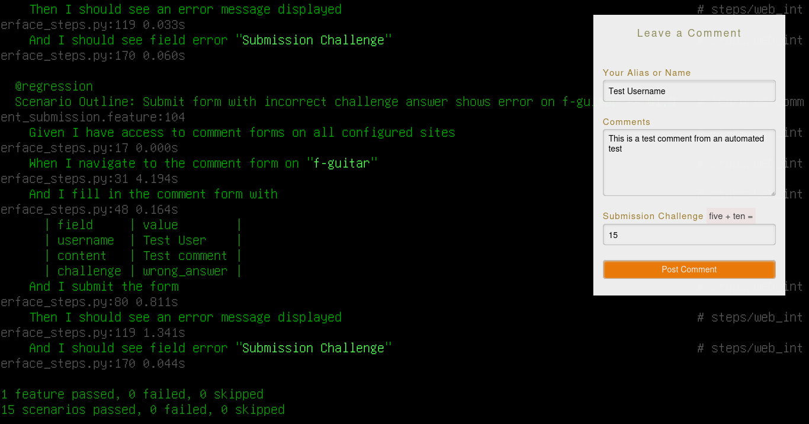

# Multi-Site Comment Form Testing Framework

BDD test automation framework for validating comment forms across multiple websites using Behave and Playwright.

---

## Features

- Test multiple sites (codesnatches.com, lifestyle.services, f-guitar.com)
- Filter tests by site using `-D site=name`
- Page Object Model pattern

---

## Prerequisites

Python 3.11+ and pip.

---

## Installation

**Step 1: Create virtual environment**

Run: `python -m venv venv`

**Step 2: Activate virtual environment**

`source venv/bin/activate`

**Step 3: Install dependencies**

Run: `pip install -r requirements.txt`

**Step 4: Install Playwright browsers**

Run: `playwright install firefox`

---

## Running Tests

- All tests: `behave`
- Smoke tests: `behave -t smoke`
- Specific site: `behave -D site=services`
- Specific scenario: `behave -n "Scenario name"`
- Detailed output: `behave --no-capture -t smoke`

---

## Project Structure

- `features/comment_submission.feature` - Gherkin scenarios
- `features/steps/web_interface_steps.py` - Step definitions
- `pages/comment_form_page.py` - Page Object Model
- `config/sites.yaml` - Site configs
- `environment.py` - Behave hooks

---

## Sample Output

1 feature passed, 0 failed, 0 skipped
5 scenarios passed, 0 failed, 0 skipped
84 steps passed, 0 failed, 0 skipped, 0 undefined
Took 0m54.514s

---

## Requirements

- behave==1.2.6
- playwright==1.40.0
- pyyaml==6.0
